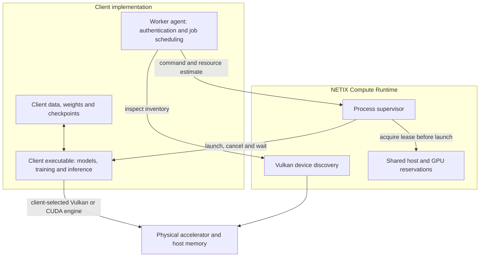

# NETIX Compute Runtime

Apache-2.0 infrastructure for running **client-owned workloads** on workers. The
Python package has no runtime dependencies; the Linux image adds a Vulkan device
probe. It coordinates resource reservations and process lifetimes across clients.



## Ownership

| Runtime owns | Clients retain, including on workers |
| --- | --- |
| Physical device discovery | Backend selection and device qualification |
| Cooperative host/GPU memory admission | Models, architectures, weights and resource estimates |
| Process supervision and cancellation | Training data, pipelines, prompts, rewards and use cases |
| Lease lifetime and memory-pressure stop | Checkpoints, results and quality evaluation |
| Versioned package and base image | Authentication, job queues, deployment and fleet promotion |

The runtime neither implements model execution nor downloads models. Moving a job
to a worker does not move its implementation or data into the public library.

## Get started

Use Python 3.11–3.14 on Linux. Download and verify a release before installation:

```sh
gh release download v0.1.0 --repo NETIX-AI-OSS/netix-compute-runtime \
  --pattern 'netix_compute_runtime-0.1.0-py3-none-any.whl'
gh attestation verify netix_compute_runtime-0.1.0-py3-none-any.whl \
  --repo NETIX-AI-OSS/netix-compute-runtime \
  --source-digest 3d3c700c0c573c7e5ec9dca17fd9e69b0c6609e4 \
  --signer-workflow NETIX-AI-OSS/netix-compute-runtime/.github/workflows/runtime.yml
python -m pip install ./netix_compute_runtime-0.1.0-py3-none-any.whl
netix-runtime-supervisor --help
```

See the [integration guide](docs/INTEGRATION.md) for the shared host configuration,
container setup and Python interfaces. The [admission reference](runtime/host_manager/README.md)
describes accounting, lease lifetime and exit codes.

## Scope and development

Admission is cooperative, single-host and single-accelerator. It does not enforce
quotas against untrusted processes, schedule jobs, or establish model accuracy.
See [supported platforms](docs/SUPPORTED_PLATFORMS.md) for qualification limits.

```sh
python -m unittest discover -s runtime/host_manager -p 'test_*.py'
python -m pip wheel --no-deps --wheel-dir dist .
python -m pip install --no-deps dist/*.whl
python -I -m unittest discover -s tests
```

CI scans secrets, tests the installed wheel and builds a model-free image on
GitHub-hosted runners. Main/tag builds publish attested artifacts; releases do not
deploy to devices. Read the [public release audit](docs/PUBLIC_RELEASE_AUDIT.md),
[license](LICENSE), [third-party notices](THIRD_PARTY_NOTICES.md) and
[contribution guide](CONTRIBUTING.md).
